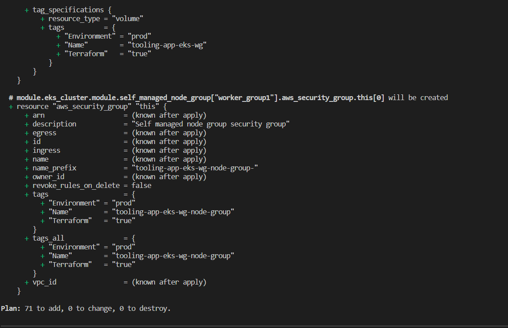
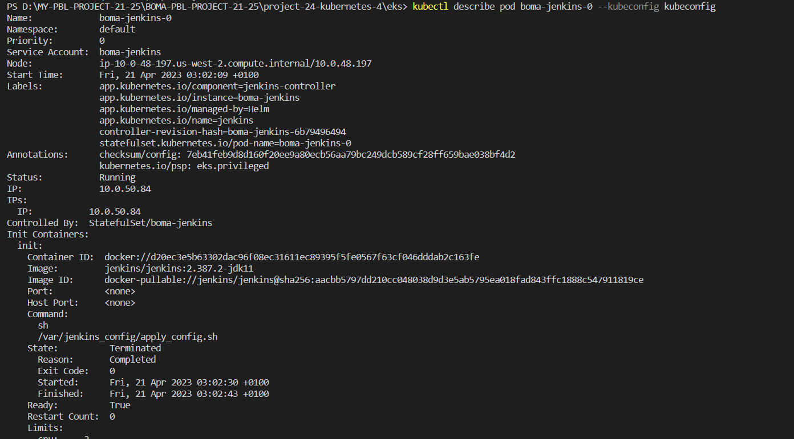
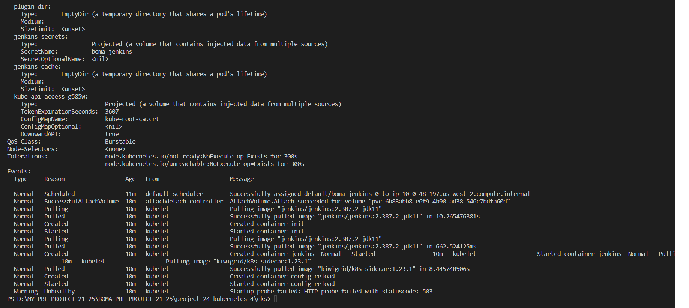
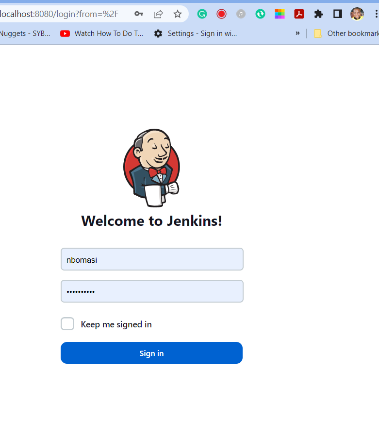
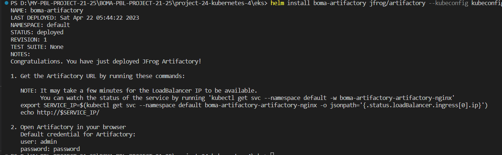
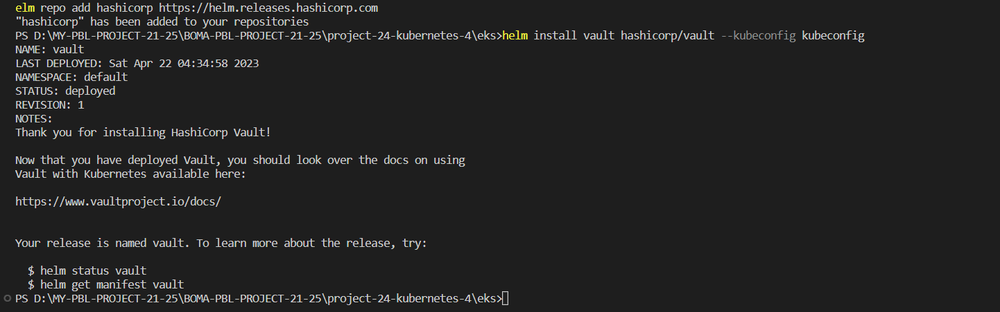
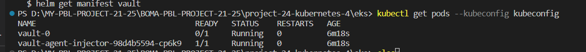
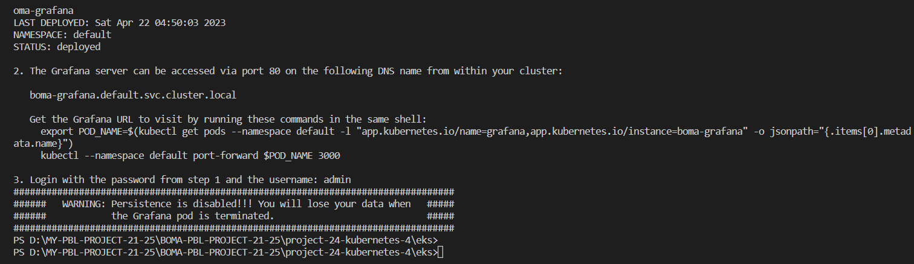
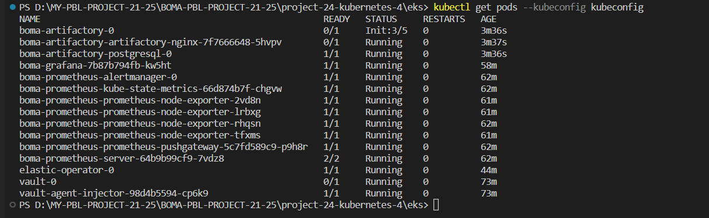

# BUILDING ELASTIC KUBERNETES SERVICE (EKS) WITH TERRAFORM

Since project 21 and 22, you have had some fragmented experience around kubernetes bootstraping and deployment of containerised applications. This project seeks to solidify your skills by focusing more on real world set up.

You will use Terraform to create a Kubernetes EKS cluster and dynamically add scalable worker nodes
You will deploy multiple applications using HELM
You will experience more kubernetes objects and how to use them with Helm. Such as Dynamic provisioning of volumes to make pods stateful
You will improve upon your CI/CD skills with Jenkins
In Project 21, you created a k8s cluster from Ground-Up. That was quite painful, but very necessary to help you master kubernetes. Going forward, you will not have to do that. Even in the real world, you will hardly ever have to do that. given that cloud providers such as AWS have managed services for kubernetes, they have done all the hard work, and with a few API calls to AWS, you can have a production grade cluster ready to go in minutes. Therefore, in this project, you begin by focusing on [EKS](https://aws.amazon.com/eks/), and how to get it up and running using Terraform. Before moving on to other things.

## Building EKS with Terraform

At this point you already have some Terraform experience. So, you have some work to do. But, you can get started with the steps below. If you have terraform code from Project 16, simply update the code and include EKS starting from number 6 below. Otherwise, follow the steps from number 1

Note: Use Terraform version v1.0.2 and kubectl version v1.23.6

Open up a new directory on your laptop, and name it eks
Use AWS CLI to create an S3 bucket
Create a file – backend.tf Task for you, ensure the backend is configured for remote state in S3
terraform {
}
Create a file – network.tf and provision Elastic IP for Nat Gateway, VPC, Private and public subnets.

```markdown
#reserve Elastic IP to be used in our NAT gateway
resource "aws_eip" "nat_gw_elastic_ip" {
vpc = true

tags = {
Name            = "${var.cluster_name}-nat-eip"
iac_environment = var.iac_environment_tag
}
}
```

Create VPC using the official AWS module

```markdown
module "vpc" {
source  = "terraform-aws-modules/vpc/aws"

name = "${var.name_prefix}-vpc"
cidr = var.main_network_block
azs  = data.aws_availability_zones.available_azs.names

private_subnets = [
#this loop will create a one-line list as ["10.0.0.0/20", "10.0.16.0/20", "10.0.32.0/20", ...]
#with a length depending on how many Zones are available
for zone_id in data.aws_availability_zones.available_azs.zone_ids :
cidrsubnet(var.main_network_block, var.subnet_prefix_extension, tonumber(substr(zone_id, length(zone_id) - 1, 1)) - 1)
]

public_subnets = [
#this loop will create a one-line list as ["10.0.128.0/20", "10.0.144.0/20", "10.0.160.0/20", ...]
#with a length depending on how many Zones are available
#there is a zone Offset variable, to make sure no collisions are present with private subnet blocks
for zone_id in data.aws_availability_zones.available_azs.zone_ids :
cidrsubnet(var.main_network_block, var.subnet_prefix_extension, tonumber(substr(zone_id, length(zone_id) - 1, 1)) + var.zone_offset - 1)
]

#Enable single NAT Gateway to save some money
#WARNING: this could create a single point of failure, since we are creating a NAT Gateway in one AZ only
#feel free to change these options if you need to ensure full Availability without the need of running 'terraform apply'
#reference: https://registry.terraform.io/modules/terraform-aws-modules/vpc/aws/2.44.0#nat-gateway-scenarios
enable_nat_gateway     = true
single_nat_gateway     = true
one_nat_gateway_per_az = false
enable_dns_hostnames   = true
reuse_nat_ips          = true
external_nat_ip_ids    = [aws_eip.nat_gw_elastic_ip.id]

#Add VPC/Subnet tags required by EKS
tags = {
"kubernetes.io/cluster/${var.cluster_name}" = "shared"
iac_environment                             = var.iac_environment_tag
}
public_subnet_tags = {
"kubernetes.io/cluster/${var.cluster_name}" = "shared"
"kubernetes.io/role/elb"                    = "1"
iac_environment                             = var.iac_environment_tag
}
private_subnet_tags = {
"kubernetes.io/cluster/${var.cluster_name}" = "shared"
"kubernetes.io/role/internal-elb"           = "1"
iac_environment                             = var.iac_environment_tag
}
}

```
**Note:** The tags added to the subnets is very important. The Kubernetes Cloud Controller Manager (cloud-controller-manager) and AWS Load Balancer Controller (aws-load-balancer-controller) needs to identify the cluster’s. To do that, it querries the cluster’s subnets by using the tags as a filter.

* For public and private subnets that use load balancer resources: each subnet must be tagged

```markdown
Key: kubernetes.io/cluster/cluster-name
Value: shared
```
* For private subnets that use internal load balancer resources: each subnet must be tagged

```markdown
Key: kubernetes.io/role/internal-elb
Value: 1
```

* For public subnets that use internal load balancer resources: each subnet must be tagged

```markdown
Key: kubernetes.io/role/elb
Value: 1
```

5. Create a file – variables.tf

```markdown
#create some variables
variable "cluster_name" {
type        = string
description = "EKS cluster name."
}
variable "iac_environment_tag" {
type        = string
description = "AWS tag to indicate environment name of each infrastructure object."
}
variable "name_prefix" {
type        = string
description = "Prefix to be used on each infrastructure object Name created in AWS."
}
variable "main_network_block" {
type        = string
description = "Base CIDR block to be used in our VPC."
}
variable "subnet_prefix_extension" {
type        = number
description = "CIDR block bits extension to calculate CIDR blocks of each subnetwork."
}
variable "zone_offset" {
type        = number
description = "CIDR block bits extension offset to calculate Public subnets, avoiding collisions with Private subnets."
}
```

6. Create a file – data.tf – This will pull the available AZs for use.

```markdown
#get all available AZs in our region
data "aws_availability_zones" "available_azs" {
state = "available"
}
data "aws_caller_identity" "current" {} # used for accesing Account ID and ARN

```

## BUILDING ELASTIC KUBERNETES SERVICE (EKS) WITH TERRAFORM – PART 2

Create a file – **eks.tf** and provision EKS cluster (Create the file only if you are not using your existing Terraform code. Otherwise you can simply append it to the main.tf from your existing code) Read more about this module from the official [documentation](https://registry.terraform.io/modules/terraform-aws-modules/eks/aws/18.20.5) here – Reading it will help you understand more about the rich features of the module.

However, I had to start affresh to solidify my understanding of public modules.

```markdown
module "eks_cluster" {
  source  = "terraform-aws-modules/eks/aws"
  version = "~> 18.0"
  cluster_name    = var.cluster_name
  cluster_version = "1.22"
  vpc_id     = module.vpc.vpc_id
  subnet_ids = module.vpc.private_subnets
  cluster_endpoint_private_access = true
  cluster_endpoint_public_access = true

  #Self Managed Node Group(s)
  self_managed_node_group_defaults = {
    instance_type                          = var.asg_instance_types[0]
    update_launch_template_default_version = true
  }
  self_managed_node_groups = local.self_managed_node_groups

  #aws-auth configmap
  create_aws_auth_configmap = true
  manage_aws_auth_configmap = true
  aws_auth_users = concat(local.admin_user_map_users, local.developer_user_map_users)
  tags = {
    Environment = "prod"
    Terraform   = "true"
  }
}
```

8.Create a file – **locals.tf** to create local variables. Terraform does not allow assigning variable to variables. There is good reasons for that to avoid repeating your code unecessarily. So a terraform way to achieve this would be to use locals so that your code can be kept [DRY](https://en.wikipedia.org/wiki/Don%27t_repeat_yourself)

```markdown
#render Admin & Developer users list with the structure required by EKS module
locals {
  admin_user_map_users = [
    for admin_user in var.admin_users :
    {
      userarn  = "arn:aws:iam::${data.aws_caller_identity.current.account_id}:user/${admin_user}"
      username = admin_user
      groups   = ["system:masters"]
    }
  ]
  developer_user_map_users = [
    for developer_user in var.developer_users :
    {
      userarn  = "arn:aws:iam::${data.aws_caller_identity.current.account_id}:user/${developer_user}"
      username = developer_user
      groups   = ["${var.name_prefix}-developers"]
    }
  ]

  self_managed_node_groups = {
    worker_group1 = {
      name = "${var.cluster_name}-wg"

      min_size      = var.autoscaling_minimum_size_by_az * length(data.aws_availability_zones.available_azs.zone_ids)
      desired_size      = var.autoscaling_minimum_size_by_az * length(data.aws_availability_zones.available_azs.zone_ids)
      max_size  = var.autoscaling_maximum_size_by_az * length(data.aws_availability_zones.available_azs.zone_ids)
      instance_type = var.asg_instance_types[0].instance_type

      bootstrap_extra_args = "--kubelet-extra-args '--node-labels=node.kubernetes.io/lifecycle=spot'"

      block_device_mappings = {
        xvda = {
          device_name = "/dev/xvda"
          ebs = {
            delete_on_termination = true
            encrypted             = false
            volume_size           = 10
            volume_type           = "gp2"
          }
        }
      }

      use_mixed_instances_policy = true
      mixed_instances_policy = {
        instances_distribution = {
          spot_instance_pools = 4
        }

        override = var.asg_instance_types
      }
    }
  }
}
```

8. Add more variables to the variables.tf file

```markdown
#create some variables
variable "admin_users" {
  type        = list(string)
  description = "List of Kubernetes admins."
}
variable "developer_users" {
  type        = list(string)
  description = "List of Kubernetes developers."
}
variable "asg_instance_types" {
  description = "List of EC2 instance machine types to be used in EKS."
}
variable "autoscaling_minimum_size_by_az" {
  type        = number
  description = "Minimum number of EC2 instances to autoscale our EKS cluster on each AZ."
}
variable "autoscaling_maximum_size_by_az" {
  type        = number
  description = "Maximum number of EC2 instances to autoscale our EKS cluster on each AZ."
}
```

9. Create a file – variables.tfvars to set values for variables.

```markdown
cluster_name            = "tooling-app-eks"
iac_environment_tag     = "development"
name_prefix             = "darey-io-eks"
main_network_block      = "10.0.0.0/16"
subnet_prefix_extension = 4
zone_offset             = 8

#Ensure that these users already exist in AWS IAM. Another approach is that you can introduce an iam.tf file to manage users separately, get the data source and interpolate their ARN.
admin_users                    = ["darey", "solomon"]
developer_users                = ["leke", "david"]
asg_instance_types             = [ { instance_type = "t3.small" }, { instance_type = "t2.small" }, ]
autoscaling_minimum_size_by_az = 1
autoscaling_maximum_size_by_az = 10
```

10. Create file – provider.tf

```markdown
provider "aws" {
  region = "us-west-1"
}

provider "random" {
}

```
11. Create a file – variables.tfvars to set values for variables.

```markdown
cluster_name            = "tooling-app-eks"
iac_environment_tag     = "development"
name_prefix             = "darey-io-eks"
main_network_block      = "10.0.0.0/16"
subnet_prefix_extension = 4
zone_offset             = 8

#Ensure that these users already exist in AWS IAM. Another approach is that you can introduce an iam.tf file to manage users separately, get the data source and interpolate their ARN.
admin_users                              = "admin"
developer_users                          = "boma"
asg_instance_types                       = ["t3.small", "t2.small"]
autoscaling_minimum_size_by_az           = 1
autoscaling_maximum_size_by_az           = 10
autoscaling_average_cpu                  = 30
```


12. Run terraform init

13. Run Terraform plan – Your plan should have an output


Plan: 71 to add, 0 to change, 0 to destroy.

Its up to 71, because, network and s3 buckets are inclusive



14. Run Terraform apply


This will begin to create cloud resources, and fail at some point with the error

```markdown
╷
│ Error: Post "http://localhost/api/v1/namespaces/kube-system/configmaps": dial tcp [::1]:80: connect: connection refused
│ 
│   with module.eks-cluster.kubernetes_config_map.aws_auth[0],
│   on .terraform/modules/eks-cluster/aws_auth.tf line 63, in resource "kubernetes_config_map" "aws_auth":
│   63: resource "kubernetes_config_map" "aws_auth" {
```

That is because for us to connect to the cluster using the kubeconfig, Terraform needs to be able to connect and set the credentials correctly.

Let fix the problem in the next section.

## FIXING THE ERROR

To fix this problem

Append to the file ```markdown
data.tf
```

```markdown
#get EKS cluster info to configure Kubernetes and Helm providers
data "aws_eks_cluster" "cluster" {
  name = module.eks_cluster.cluster_id
}
data "aws_eks_cluster_auth" "cluster" {
  name = module.eks_cluster.cluster_id
}
```

* Append to the file provider.tf

```markdown
#get EKS authentication for being able to manage k8s objects from terraform
provider "kubernetes" {
  host                   = data.aws_eks_cluster.cluster.endpoint
  cluster_ca_certificate = base64decode(data.aws_eks_cluster.cluster.certificate_authority.0.data)
  token                  = data.aws_eks_cluster_auth.cluster.token
}
```

* Run the init and plan again – This time you will see

```markdown
Output:
```

```markdown
# module.eks_cluster.kubernetes_config_map.aws_auth[0] will be created
  + resource "kubernetes_config_map" "aws_auth" {      
      + data = {
          + "mapAccounts" = jsonencode([])
          + "mapRoles"    = <<-EOT
                - "groups":
                  - "system:bootstrappers"
                  - "system:nodes"
                  "rolearn": "arn:aws:iam::276053850875:role/tooling-app-eks-wg-node-group-20230419213900284500000002"
                  "username": "system:node:{{EC2PrivateDNSName}}"
            EOT
          + "mapUsers"    = <<-EOT
                - "admin"
                - "boma"
            EOT
        }
      + id   = (known after apply)

      + metadata {
          + generation       = (known after apply)     
          + name             = "aws-auth"
          + namespace        = "kube-system"
          + resource_version = (known after apply)     
          + uid              = (known after apply)     
        }
    }

  # module.eks_cluster.kubernetes_config_map_v1_data.aws_auth[0] will be created
  + resource "kubernetes_config_map_v1_data" "aws_auth" {
      + data          = {
          + "mapAccounts" = jsonencode([])
          + "mapRoles"    = <<-EOT
                  "rolearn": "arn:aws:iam::276053850875:role/tooling-app-eks-wg-node-group-20230419213900284500000002"
                  "username": "system:node:{{EC2PrivateDNSName}}"
            EOT
          + "mapUsers"    = <<-EOT
                - "admin"
                - "boma"
            EOT
        }
      + field_manager = "Terraform"
      + force         = true
      + id            = (known after apply)

      + metadata {
          + name      = "aws-auth"
          + namespace = "kube-system"
        }
    }

Plan: 2 to add, 0 to change, 0 to destroy.
```

15. Create kubeconfig file using awscli.

```markdown
aws eks update-kubecofig --name <cluster_name> --region <cluster_region> --kubeconfig kubeconfig
```

## DEPLOY APPLICATIONS WITH HELM

In Project 22, you experienced the use of manifest files to define and deploy resources like pods, deployments, and services into Kubernetes cluster. Here, you will do the same thing except that it will not be passed through **kubectl**. In the real world, Helm is the most popular tool used to deploy resources into kubernetes. That is because it has a rich set of features that allows deployments to be packaged as a unit. Rather than have multiple YAML files managed individually – which can quickly become messy.

A Helm chart is a definition of the resources that are required to run an application in Kubernetes. Instead of having to think about all of the various deployments/services/volumes/configmaps/ etc that make up your application, you can use a command like

```markdown
helm install stable/mysql
```

and Helm will make sure all the required resources are installed. In addition you will be able to tweak helm configuration by setting a single variable to a particular value and more or less resources will be deployed. For example, enabling slave for MySQL so that it can have read only replicas.

Behind the scenes, a helm chart is essentially a bunch of YAML manifests that define all the resources required by the application. Helm takes care of creating the resources in Kubernetes (where they don’t exist) and removing old resources.

Lets begin to gradually walk through how to use [Helm](https://andrewlock.net/series/deploying-asp-net-core-applications-to-kubernetes/)

1. Parameterising YAML manifests using Helm templates

Let’s consider that our Tooling app have been Dockerised into an image called tooling-app, and that you wish to deploy with Kubernetes. Without helm, you would create the YAML manifests defining the deployment, service, and ingress, and apply them to your Kubernetes cluster using **kubectl apply**. Initially, your application is version 1, and so the Docker image is tagged as **tooling-app:1.0.0**. A simple deployment manifest might look something like the following:

```markdown
apiVersion: apps/v1
kind: Deployment
metadata:
  name: tooling-app-deployment
  labels:
    app: tooling-app
spec:
  replicas: 3
  strategy: 
    type: RollingUpdate
    rollingUpdate:
      maxUnavailable: 1
  selector:
    matchLabels:
      app: tooling-app
  template:
    metadata:
      labels:
        app: tooling-app
    spec:
      containers:
      - name: tooling-app
        image: "tooling-app:1.0.0"
        ports:
        - containerPort: 80
```
Now lets imagine you produce another version of your app, version 1.1.0. How do you deploy that? Assuming nothing needs to be changed with the service or ingress, it may be as simple as copying the deployment manifest and replacing the image defined in the spec section. You would then re-apply this manifest to the cluster, and the deployment would be updated, performing a rolling-update as I described in my first post.

The main problem with this is that all of the values specific to your application – the labels and the image names etc – are mixed up with the "mechanical" definition of the manifest.

Helm tackles this by splitting the configuration of a chart out from its basic definition. For example, instead of baking the name of your app or the specific container image into the manifest, you can provide those when you install the chart into the cluster.

For example, a simple templated version of the previous deployment might look like the following:

```markdown
apiVersion: apps/v1
kind: Deployment
metadata:
  name: {{ .Release.Name }}-deployment
  labels:
    app: "{{ template "name" . }}"
spec:
  replicas: 3
  strategy: 
    type: RollingUpdate
    rollingUpdate:
      maxUnavailable: 1
  selector:
    matchLabels:
      app: "{{ template "name" . }}"
  template:
    metadata:
      labels:
        app: "{{ template "name" . }}"
    spec:
      containers:
      - name: "{{ template "name" . }}"
        image: "{{ .Values.image.name }}:{{ .Values.image.tag }}"
        ports:
        - containerPort: 80
```
This example demonstrates a number of features of Helm templates:

The template is based on YAML, with {{ }} mustache syntax defining dynamic sections.
Helm provides various variables that are populated at install time. For example, the {{.Release.Name}} allows you to change the name of the resource at runtime by using the release name. Installing a Helm chart creates a release (this is a Helm concept rather than a Kubernetes concept).
You can define helper methods in external files. The {{template "name"}} call gets a safe name for the app, given the name of the Helm chart (but which can be overridden). By using helper functions, you can reduce the duplication of static values (like tooling-app), and hopefully reduce the risk of typos.

You can manually provide configuration at runtime. The {{.Values.image.name}} value for example is taken from a set of default values, or from values provided when you call helm install. There are many different ways to provide the configuration values needed to install a chart using Helm. Typically, you would use two approaches:

A values.yaml file that is part of the chart itself. This typically provides default values for the configuration, as well as serving as documentation for the various configuration values.

When providing configuration on the command line, you can either supply a file of configuration values using the -f flag. We will see a lot more on this later on.

**Now lets setup Helm and begin to use it**.

According to the official [documentation here](https://helm.sh/docs/intro/install/), there are different options to installing Helm. But we will build the source code to create the binary.

1. [Download](https://github.com/helm/helm/releases) the tar.gz file from the project’s Github release page. Or simply use wget to download version 3.6.3 directly

```markdown
wget https://github.com/helm/helm/archive/refs/tags/v3.6.3.tar.gz
```

2. Unpack the tar.gz file

```markdown
tar -zxvf v3.6.3.tar.gz 
```
3. cd into the unpacked directory

```markdown
cd helm-3.6.3
```

4. Build the source code using **make** utility

```markdown
make build
```

If you do not have **make** installed or for any other reason, you cannot install the tool, simply use the official [documentation here](https://helm.sh/docs/intro/install/) for other options.

5. Helm binary will be in the bin folder. Simply move it to the bin directory on your system. You cna check other tools to know where that is. fOr example, check where pwd utility is being called from by running which pwd. Assuming the output is /usr/local/bin. You can move the helm binary there.

```markdown
sudo mv bin/helm /usr/local/bin/
```

6. Check that Helm is installed

```markdown
helm version
```

Helm-installed:

```markdown
version.BuildInfo{Version:"v3.11.3", GitCommit:"323249351482b3bbfc9f5004f65d400aa70f9ae7", GitTreeState:"clean", GoVersion:"go1.20.3"}
```

**NOTE:** I use both windows and WSL

For windows I used chocolatey package manager: 

```markdown
choco install kubernetes-helm

```

While on WSL I used: 

```markdown
curl https://baltocdn.com/helm/signing.asc | gpg --dearmor | sudo tee /usr/share/keyrings/helm.gpg > /dev/null
sudo apt-get install apt-transport-https --yes
echo "deb [arch=$(dpkg --print-architecture) signed-by=/usr/share/keyrings/helm.gpg] https://baltocdn.com/helm/stable/debian/ all main" | sudo tee /etc/apt/sources.list.d/helm-stable-debian.list
sudo apt-get update
sudo apt-get install helm
```

## DEPLOY JENKINS WITH HELM

Before we begin to develop our own helm charts, lets make use of publicly available charts to deploy all the tools that we need.

One of the amazing things about helm is the fact that you can deploy applications that are already packaged from a public helm repository directly with very minimal configuration. An example is Jenkins.

1. Visit [Artifact Hub](https://artifacthub.io/packages/search) to find packaged applications as Helm Charts

2. Search for Jenkins

3. Add the repository to helm so that you can easily download and deploy

```markdown
helm repo add jenkins https://charts.jenkins.io
```

4. Update helm repo

```markdown
helm repo update 
```
5. Install the chart

```markdown
helm install [RELEASE_NAME] jenkins/jenkins --kubeconfig [kubeconfig file]
```
You should see an output like this

```markdown
NAME: jenkins
LAST DEPLOYED: Sun Aug  1 12:38:53 2021
NAMESPACE: default
STATUS: deployed
REVISION: 1
NOTES:
1. Get your 'admin' user password by running:
  kubectl exec --namespace default -it svc/boma-jenkins -c jenkins -- /bin/cat /run/secrets/additional/chart-admin-password && echo
2. Get the Jenkins URL to visit by running these commands in the same shell:
  echo http://127.0.0.1:8080
  kubectl --namespace default port-forward svc/jenkins 8080:8080

3. Login with the password from step 1 and the username: admin
4. Configure security realm and authorization strategy
5. Use Jenkins Configuration as Code by specifying configScripts in your values.yaml file, see documentation: http:///configuration-as-code and examples: https://github.com/jenkinsci/configuration-as-code-plugin/tree/master/demos

For more information on running Jenkins on Kubernetes, visit:
https://cloud.google.com/solutions/jenkins-on-container-engine

For more information about Jenkins Configuration as Code, visit:
https://jenkins.io/projects/jcasc/

NOTE: Consider using a custom image with pre-installed plugins
Check the Helm deployment

```
```markdown
helm ls --kubeconfig [kubeconfig file]
```

Output:

```markdown
NAME    NAMESPACE       REVISION        UPDATED                                 STATUS          CHART           APP VERSION
jenkins default         1               2021-08-01 12:38:53.429471 +0100 BST    deployed        jenkins-3.5.9   2.289.3
``` 

7. Check the pods:

```markdown
kubectl get pods --kubeconfigo [kubeconfig file]
```

Output:

```markdown
NAME        READY   STATUS    RESTARTS   AGE
jenkins-0   2/2     Running   0          6m14s
```

8. Describe the running pod (review the output and try to understand what you see)

```markdown
kubectl describe pod boma-jenkins-0 --kubeconfig [kubeconfig file]
```


9. Check the logs of the running pod

```markdown
kubectl logs boma-jenkins-0 --kubeconfig [kubeconfig file]
```


You will notice an output with an error

```markdown
error: a container name must be specified for pod jenkins-0, choose one of: [jenkins config-reload] or one of the init containers: [init]
```

This is because the pod has a Sidecar container alongside with the Jenkins container. As you can see fromt he error output, there is a list of containers inside the pod **[jenkins config-reload]** i.e **jenkins** and config-reload containers. The job of the **config-reload** is mainly to help Jenkins to reload its configuration without recreating the pod.

Therefore we need to let **kubectl** know, which pod we are interested to see its log. Hence, the command will be updated like:

```markdown
kubectl logs boma-jenkins-0 -c jenkins --kubeconfig [kubeconfig file]

```
10. Now lets avoid calling the [kubeconfig file] everytime. Kubectl expects to find the default kubeconfig file in the location ~/.kube/config. But what if you already have another cluster using that same file? It doesn’t make sense to overwrite it. What you will do is to merge all the kubeconfig files together using a kubectl plugin called [konfig](https://github.com/corneliusweig/konfig) and select whichever one you need to be active.

1. Install a package manager for kubectl called krew so that it will enable you to install plugins to extend the functionality of kubectl. Read more about it [Here](https://github.com/kubernetes-sigs/krew)

2. Install the [konfig plugin](https://github.com/corneliusweig/konfig)

  ```markdown
  kubectl krew install konfig
  ```
**NOTE: Krew was installed successfully on windows, but konfig plugin could not be imported on windows since there is no versionsion yet for windows.**

3. Import the kubeconfig into the default kubeconfig file. Ensure to accept the prompt to overide.

  ```markdown
  sudo kubectl konfig import --save  [kubeconfig file]
  ```
**Note: THe above did not work in WSL. Even at that the same purpose was still realized, I could avoid "--kubeconfig" flag**

4. Show all the contexts – Meaning all the clusters configured in your kubeconfig. If you have more than 1 Kubernetes clusters configured, you will see them all in the output.

  ```markdown
  kubectl config get-contexts
  ```

5. Set the current context to use for all kubectl and helm commands

  ```markdown
  kubectl config use-context [name of EKS cluster]
  ```

6. Test that it is working without specifying the --kubeconfig flag

  ```markdown
  kubectl get po
  ```

Output:

 ```markdown
  NAME        READY   STATUS    RESTARTS   AGE
  boma-jenkins-0   2/2     Running   0          84m
 ```
7. Display the current context. This will let you know the context in which you are using to interact with Kubernetes.

  ```markdown
  kubectl config current-context
  ```

11. Now that we can use kubectl without the --kubeconfig flag, Lets get access to the Jenkins UI. (In later projects we will further configure Jenkins. For now, it is to set up all the tools we need)

1. There are some commands that was provided on the screen when Jenkins was installed with Helm. See number 5 above. Get the password to the **admin** user

Note that Jenkins installation output will give you the info below

Output from jenkins deployment


  ```markdown
  kubectl exec --namespace default -it svc/jenkins -c jenkins -- /bin/cat /run/secrets/additional/chart-admin-password && echo
  ```
2. Use port forwarding to access Jenkins from the UI

  ```markdown
  kubectl --namespace default port-forward svc/jenkins 8080:8080
  ```


3. Go to the browser localhost:8080 and authenticate with the username and password from number 1 above



## QUICK TASK (OTHER TASK)

### 1. Installation of Artifactory with Helm

```markdown
helm repo add jfrog https://charts.jfrog.io
helm repo update
```

```markdown
helm upgrade --install boma-artifactory jfrog/artifactory --kubeconfig kubeconfig

```


uninstalling:

```markdown
helm uninstall artifactory && sleep 90 && kubectl delete pvc -l app=artifactory

helm delete artifactory --namespace artifactory
```
[Artifactory Link](https://artifacthub.io/packages/helm/jfrog/artifactory)

### 2. Installing Hashicorp vault

```markdown
$ helm repo add hashicorp https://helm.releases.hashicorp.com
```

```markdown
$ helm install vault hashicorp/vault
```



[Vault Link](https://artifacthub.io/packages/helm/hashicorp/vault)


### 3. Installing Prometheus

```markdown
helm repo add prometheus-community https://prometheus-community.github.io/helm-charts

helm repo update

```

```markdown
helm install [RELEASE_NAME] prometheus-community/prometheus


helm install boma-prometheus prometheus-community/prometheus --kubeconfig kubeconfig
```


[Prometheus Link](https://artifacthub.io/packages/helm/prometheus-community/prometheus)


### 4. Installing Grafana

```markdown
helm repo add grafana https://grafana.github.io/helm-charts
helm repo update
```
```markdown
helm install [my-release] grafana/grafana

```
```markdown
helm install boma-grafana grafana/grafana --kubeconfig kubeconfig
```


[Grafana link](https://artifacthub.io/packages/helm/grafana/grafana)

uninstalling grafana
```markdown
helm delete my-release
```
### 4. Installing Elastic Search

```markdown
helm repo add elastic https://helm.elastic.co
helm repo update
```

```markdown
helm install elastic-operator elastic/eck-operator -n elastic-system --create-namespace
```

```markdown
helm install boma-search elastic/eck-operator -n elastic-system --kubeconfig kubeconfig
```

[Elastic Search link](https://www.elastic.co/guide/en/cloud-on-k8s/current/k8s-install-helm.html)


**All Pods running**




### Challenge faced during GITPUSH:

I mistatenkely included .terraform folder, after that I kept getting error of LARGE FILE above 100 mb
I deleted the folder, spend lot of time to no avail. 

**Final solution:** I ran:

```$ git status```

I got the message that I got 2 commits ahead of the origin main. Then I ran the following command and that was the end of the issue

 `git reset HEAD~2`

After running the command, then I added and pushed again. note the number 2 attach to HEAD determined the number of commit 

[Credit](https://gist.github.com/duttashi/1011d1b52e3cc288df402807c1b20521)

### End of project 24


